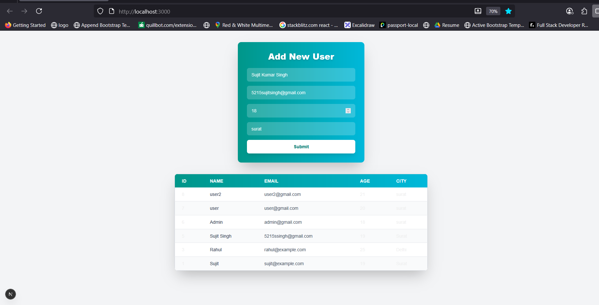
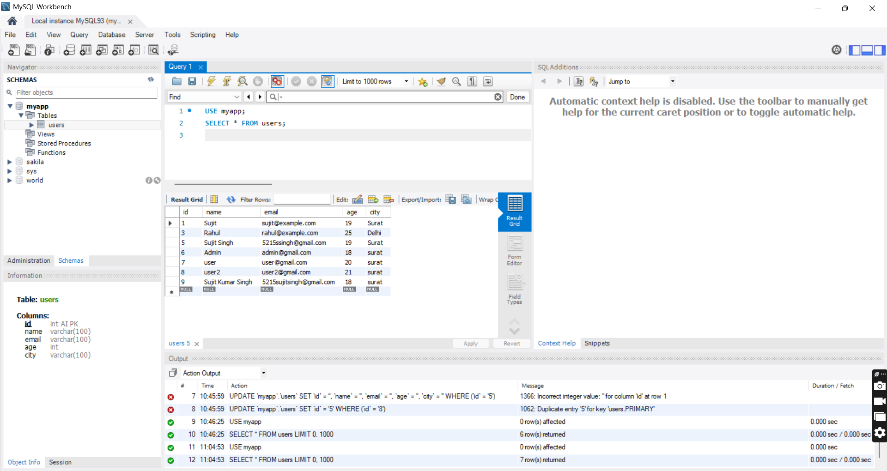
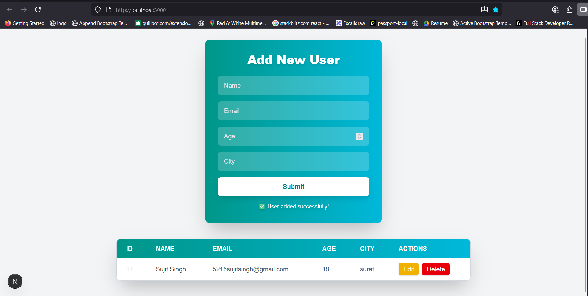
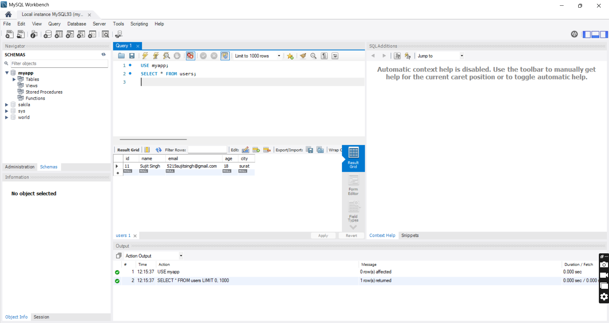

# October-2025
tenacious techies

<!-- ====================================================================================== -->

# 🧑‍💻 Full Stack User Management App (Next.js + MySQL)

This is a full-stack web application that allows users to add, update, delete, and view their information (name, email, age, city). The data is stored in a MySQL database and displayed in a responsive table. Built using Next.js (React), MySQL, and Tailwind CSS.


---

## 🚀 Features

- ✅ Add user information via a form  
- ✅ Store data in MySQL using Next.js API routes  
- ✅ Display users in a table with real-time updates  
- ✅ Edit and delete users  
- ✅ View and verify data in MySQL Workbench  
- ✅ Responsive UI with Tailwind CSS  
- ✅ Full stack flow: **Form → API → MySQL → UI**  


## 📷 Screenshots

| Form | Users Table |
|------|-------------|
|  |  |
|  |  |


*(Add your screenshots in a `/screenshots` folder if needed)*

---

## 🏗️ Technologies Used

- **Frontend:** Next.js (React), Tailwind CSS
- **Backend:** API Routes (`/api` in Next.js)
- **Database:** MySQL
- **ORM/Driver:** `mysql2/promise`
- **Admin Tool:** MySQL Workbench

---

## 📁 Project Structure

my-next-mysql-app/
│── components/
│   ├── UserForm.jsx        # Add/Edit User Form
│   ├── UsersTable.jsx      # User Table
│
│── lib/
│   └── db.js               # MySQL Database Connection Pool
│
│── pages/
│   └── api/
│       ├── add-user.js     # Add User API
│       ├── delete-user.js  # Delete User API
│       ├── get-users.js    # Get Users API
│       ├── update-user.js  # Update User API
│
│── app/
│   ├── layout.js           # Root Layout with Fonts
│   └── page.js             # Home Page (Form + Table)
│
│── .env.local              # Environment Variables
│── package.json
│── README.md
│── tailwind.config.js
│── globals.css


## ⚙️ Setup Instructions

### 1. Clone the Repository

```bash
git clone https://github.com/your-username/your-repo-name.git
cd your-repo-name
```

---

### 2. Install Dependencies

```bash
npm install
```

---

### 3. Create `.env.local` File

Create a `.env.local` file in the root of your project and add the following:

```env
DB_HOST=localhost
DB_USER=root
DB_PASSWORD=your_mysql_password
DB_NAME=myapp
DB_PORT=3306
```

---

### 4. Set Up MySQL Database

Open **MySQL Workbench** or use CLI and run:

```sql
CREATE DATABASE IF NOT EXISTS myapp;

USE myapp;

CREATE TABLE IF NOT EXISTS users (
  id INT AUTO_INCREMENT PRIMARY KEY,
  name VARCHAR(100) NOT NULL,
  email VARCHAR(100) NOT NULL UNIQUE,
  age INT NOT NULL,
  city VARCHAR(100) NOT NULL
);
```

---

### 5. Run the App

```bash
npm run dev
```

Then open your browser and go to:

```
http://localhost:3000
```
